# Ruby on Rails - Recipe Management System

  

## 📋 สรุปโปรเจค

### 1. ระบบแบ่งส่วนการใช้งาน

- **Public (ไม่ต้อง login)**: Landing Page แสดงเมนูอาหารทั้งหมด
- **Protected (ต้อง login)**: ระบบจัดการ CRUD เมนูอาหารและส่วนประกอบ

### 2. User Roles และ Permissions

| Role     | Email               | Password   | สิทธิ์             |
| -------- | ------------------- | ---------- | ------------------ |
| 👑 Admin | `admin@example.com` | `password` | Manage All (CRUD)  |
| 👨‍💼 Staff | `staff@example.com` | `password` | Read, Edit, Update |
| 🚫 Guest | ไม่ได้ login        | -          | Read Only          |

### 3. Image Preview ด้วย Stimulus

- Preview รูปภาพทันทีเมื่อเลือกไฟล์
- รองรับ Drag & Drop
- แสดงชื่อไฟล์และขนาด
- **ลบรูปภาพได้เมื่อ upload ผิด**

---

## � Screenshots

### Image 1 - Landing Page

หน้าแรกที่ไม่ต้อง login สามารถดูเมนูอาหารทั้งหมดได้

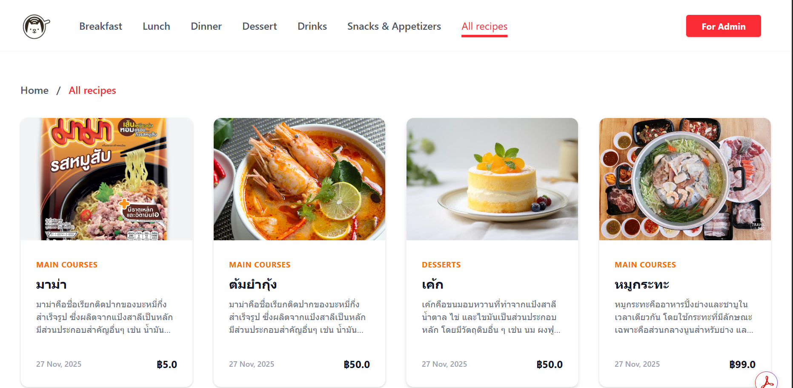

### Image 2 - Login Page

หน้า Login สำหรับ Admin

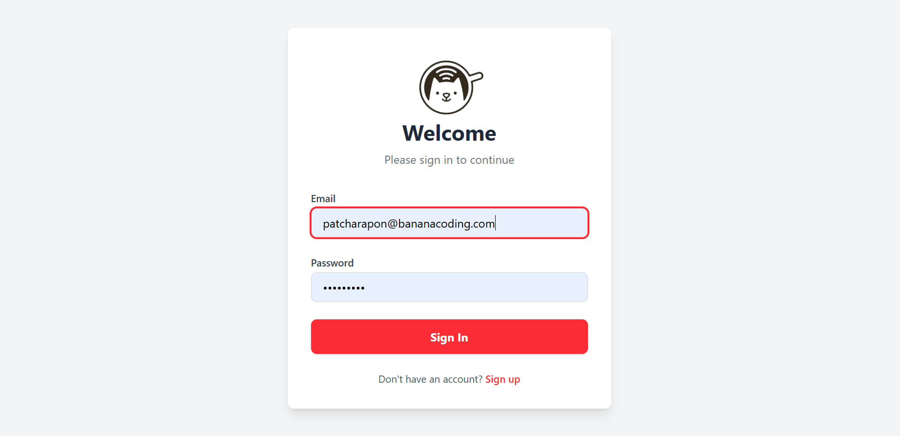

#### Image 2.1 - Recipe Menu

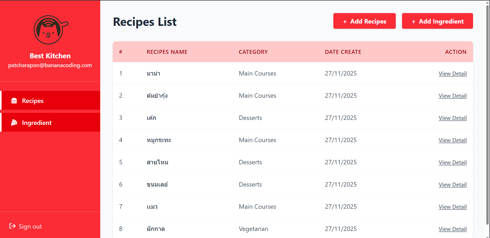

#### Image 2.2 - add recipe

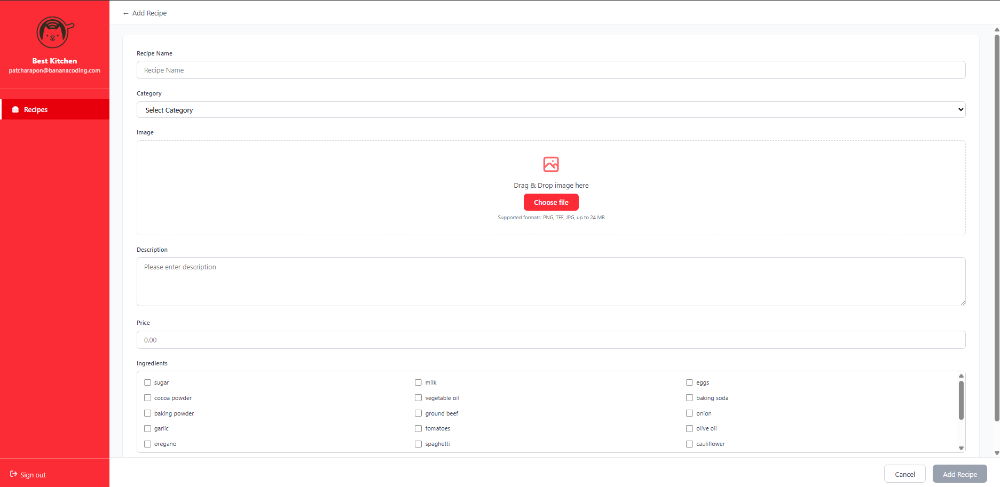

#### Image 2.3 - add image recipe

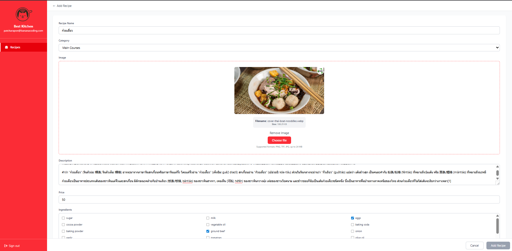

#### Image 2.4 - Edit recipe

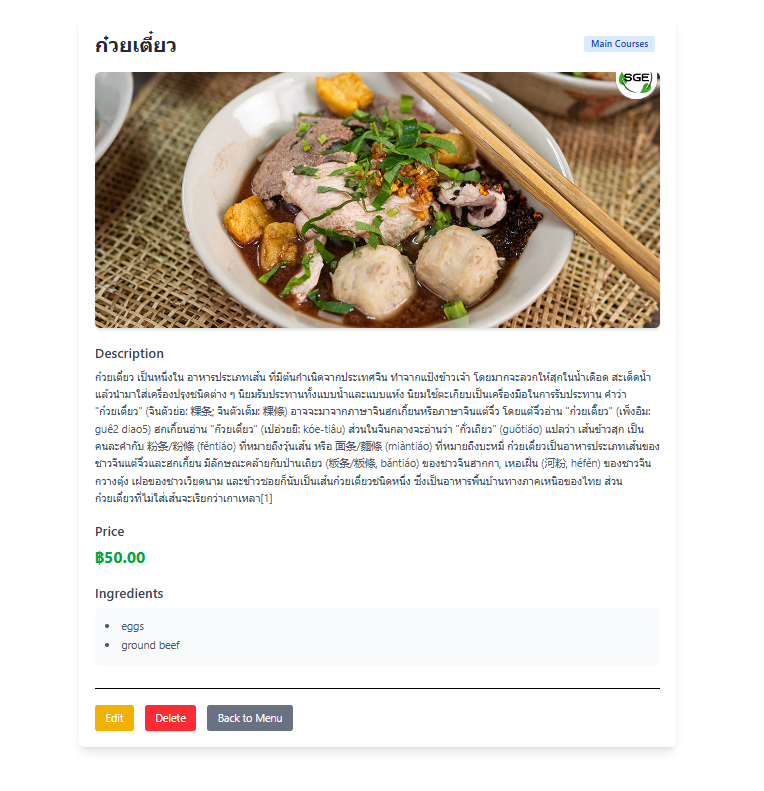

#### Image 2.5 - Add new ingredient

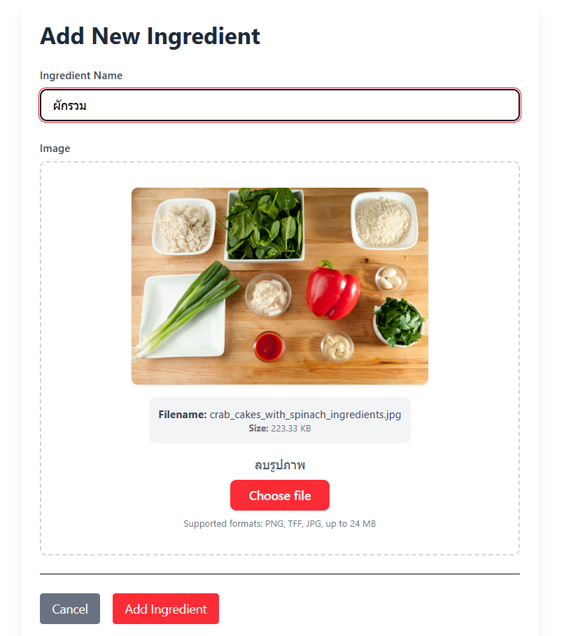

#### Image 2.6 - Ingredient Menu

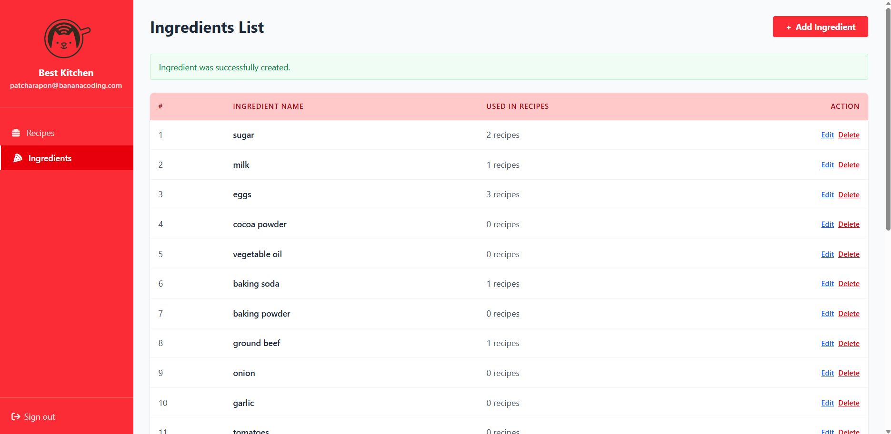

### Image 3 - หน้า login สำหรับ Staff

หน้า Login สำหรับ Staff

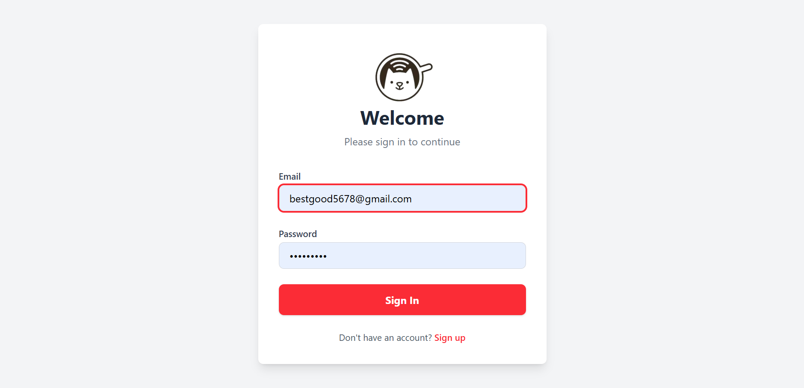

#### Image 3.1 - หน้า Recipe Menu สำหรับ Staff

หน้า Recipe Menu สำหรับ Staff

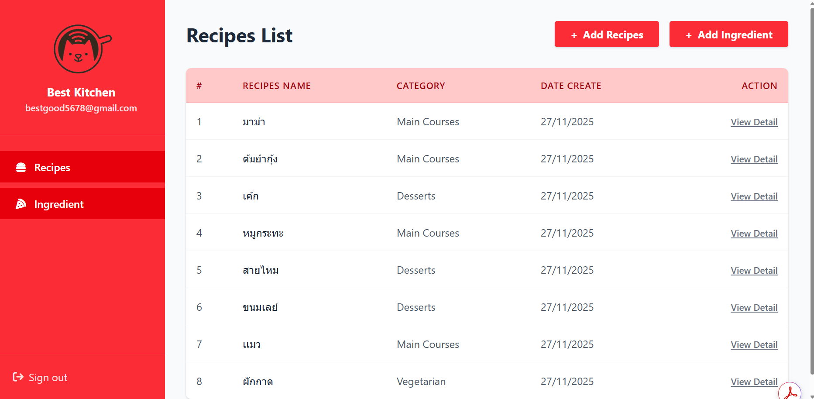

#### Image 3.2 - หน้า recipe menu สำหรับ Staff

ไม่สามารถ add delete หรือ edit recipe กับ Add new ingredient ได้

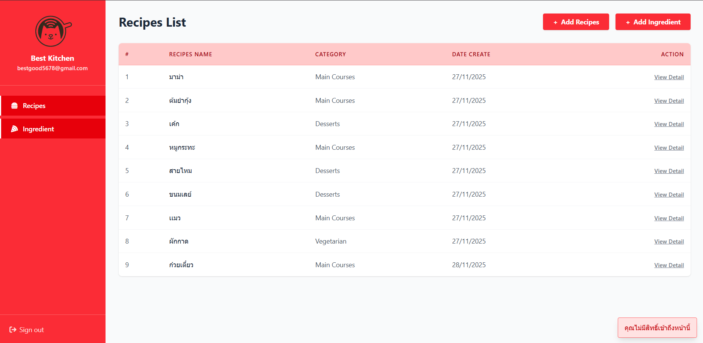

### Image 4 - Categories Menu

หน้า Categories สำหรับจัดการหมวดหมู่อาหาร

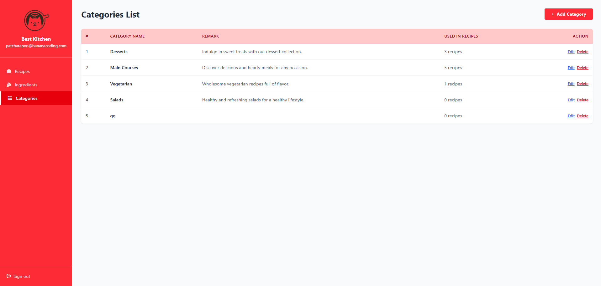

#### Image 4.1 - Add New Category

หน้าเพิ่ม Category ใหม่

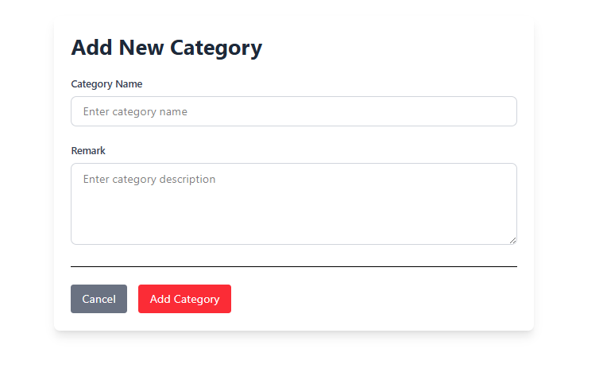
